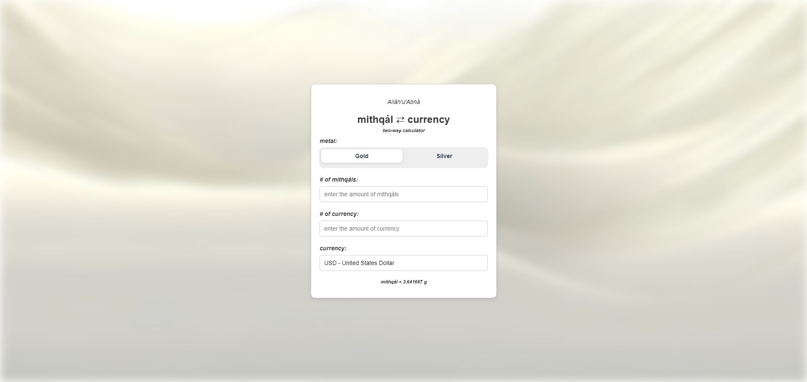

# Mithqal Currency Calculator

A fullstack two-way modern calculator to convert (Baháʼí Mithqáls of Gold/Silver<->Currency) applicable to all ISO 4217 certified currencies.
Languages used: HTML, CSS, JavaScript and TypeScript.


## Features
- **Two-way conversion:**
  - Convert mithqáls to monetary value.
  - Convert monetary value to mithqáls.
- **Live precious metal pricing:**
  - Fetches real-time gold and silver prices.
- **Live currency conversion rate:**
  - Uses USD as the base currency and supports conversions into all ISO 4217 certified currencies.
- **Server-side caching for offline support:**
  - Server caching provides fall-back for any API downtime for gold, silver and major currencies.

---

## Project Structure

### Files
1. **`script.js`:** Handles the front-end logic for conversions.
2. **`server.ts`:** A back-end server utilizing deno 2 built to fetch and cache gold/silver prices and major currency conversion rates such as USD, EUR, GBP, INR, CAD.
3. **`favicon.ico`:** Website Icon.
4. **`image.png`:** Image of the webpage for the README.
5. **`index.html`:** The main page that holds the calculator process.
6. **`style.css`:** Pure CSS styling for the HTML.

---

## Installation & Setup

### Prerequisites
1. **Deno:** Install Deno.
2. **Live Server Extension (or equiavlent):** To run the HTML locally for convenience.

### Steps
1. **Clone the GitHub Rep:**
   ```bash
   git clone https://github.com/r7ni/mithqal
   cd mithqal
   ```
2. **Run the Server:**
   ```bash
   deno run --allow-net server.ts
   ```
3. **Open the Frontend:**
   - Open the `index.html` file in your choice of browser.

---

## Usage Guide

### Performing Calculations
1. **Select Metal Type:**
   - Choose either "Gold" or "Silver" for your needs.
2. **Input Mithqál Value:**
   - Enter the number of mithqáls to convert to money.
   - The corresponding monetary value will be updated accordingly.
3. **Input Money Value:**
   - Enter the amount of money to convert to mithqáls.
   - The equivalent mithqál value will be updated accordingly.
4. **Change Currency:**
   - Select your desired currency from the dropdown list.
   - The monetary value will be updated accordingly.

---

## Notes
1. **API Limits:** The information is accurate so long as the information provided by the APIs are accurate. If this product were to be released you may opt to use a paid API for better reliability and accuracy.
2. **Currency Support:** Currently there is about 40 currencies supported and you can easily add on your desired currency by adding one line in the HTML as the logic is automatically handled by functions.
3. **Back-end:** Currently this is a full-stack program and if published it should stay as so. However, for practice I placed functions that servet.ts does in the other files allowing it to be run without the server if need be and only needs minor tweaking to run without the server. Obviously, the server serves as a good strong backdrop if the APIs fail.
